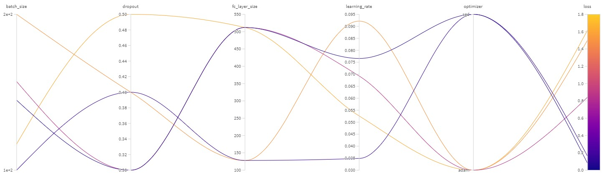
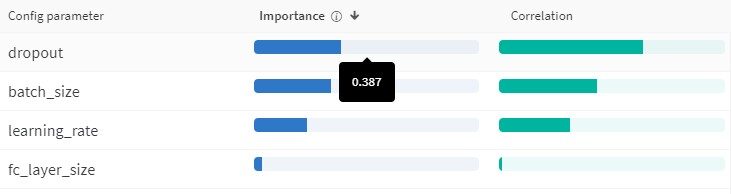

# MLOps_wandb

Why wandb for hyperparameter tuning (Sweeps service)?

Altough the embedded python code in the application can create the same functionality in terms hyperparameter tuining, utilization of wandb leads to far easier implementation where the results are reported and visualized real-time and the optimal rates are suggested quite straightforward. Plus, the collaborative environment of wandb, makes the teams to share the results in a secure and real-time manner.

<h2>Result example:</h2> 

NB: in the above image, each line is a run (ie, running the model with configuration set of X) and its color is showing the loss

